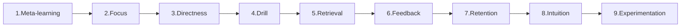

# 1. Meta-learning (Planning The Learning)

- Before you start, research the skill to learn how to learn it, create a "map" of the skill, and define clear learning goals and a project format.
- 10% of duration should be dedicated (why, what, how)
- Use AI prompts

# 2. Focus (Minimize Distractions)

- Minimize distractions by developing concentration and allocating specific times to learn deeply and productively

# 3. Directness (Learning By Doing)

- Learn the skill by doing it directly, rather than relying solely on passive study.
- Project-based and immersive learning are examples of direct learning.
- Practice what is really matters.

# 4. Drill (Targeting Weaknesses)

- Write down questions and stuff that is not understood.
- Attack your weakest points by identifying the specific skills or concepts you struggle with and focusing your efforts on practicing those areas.

# 5. Retrieval (Testing Yourself)

- Test yourself frequently to strengthen recall and memory.
- Do mock exams and practice interviews questions.

# 6. Feedback (Getting Accurate Input)

- Seek out immediate, intense, and accurate feedback to understand what you're doing wrong and how to improve.
- 3 types of outcomes (outcome feedback, information feedback, feedback by mentor)

# 7.  Retention (Remembering Information Long-term)

- Employ techniques like spaced repetition, overlearning, and mnemonics to improve your memory and remember information long-term.

# 8. Intuition (Deeply Understanding Concepts)

- Develop a deep understanding of a subject by focusing on examples and exploring concepts to build intuition, rather than just memorizing facts.
- Use Feynman technique to teach other for better understanding.

# 9. Experimentation (Exploring New Approaches)

- Step outside your comfort zone to explore new or unconventional approaches to learning and find what works best for you.