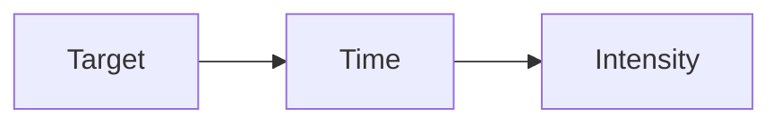

# 5 Steps of Fixing Attention Span

## 1st Step
**Win Criteria** --> A standard most meet to archive success or secure a win.

## 2nd Step
**Understand the rule of the game**

## 3rd Step
**Short term & long term strategy**

## 4th Step
**Optimizing short term strategy**
- Deep work for short term
	- clear objective
	- singular task
	- prep the hard stuff
	- plan to start not to finish

**Active Zeigarnik effect**

**Front Load**
- No distraction
- Far in advance

## 5th Step
**Optimizing long term strategy**
- Focus muscle

