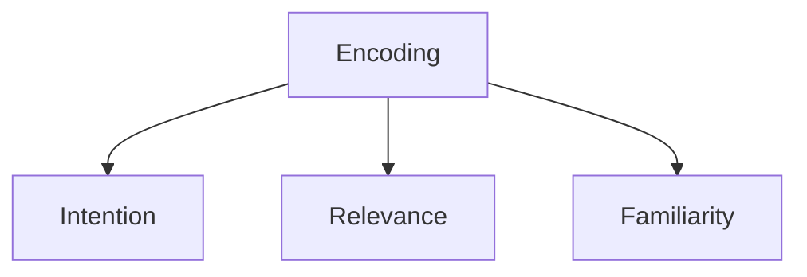
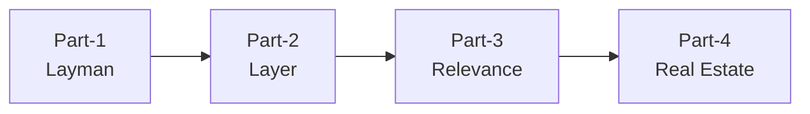

# Info of Encoding Memory

# 4 Parts of Textbook Reading

## Part-1 Layman's Term
**Layman's term** means simple English language which intended to be easy to understand regardless of one's familiarity with a given topic.
- Ask AI to learn about key words of the book / learning topic.
- Ask AI to explain in **Layman's term**. 

## Part-2 Layer
- While reading, just skip it when feels difficult and then come back later.

## Part-3 Relevance
- Look at test questions or end of chapter questions before start properly going through all the content
- Ask "why would I need to know this?".
- Which parts of what I am learning still feel like it doesn't quite make sense?
- Which parts are harder for me to understand?
- Which are the ones that feel less related and less familiar?

## Part-4 Real Estate
- To think on paper.
- Write the thoughts down, document it.
- Use note taking as a cognitive off load.