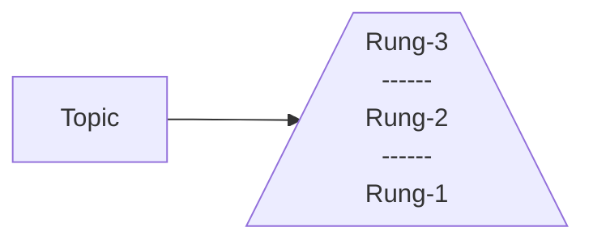

## 3 Main Ways The Brain Uses Energy
1. To understand what it is consuming.
2. To compare it with what you already know.
3. To decide where to put the information.
(Should spend more energy on making sure the decision and comparison are correct.)

## The **LADDER Method**
The **ladder method** is the process of breaking off the topic into different rungs like ladder and each ladder should be low effort to study.

