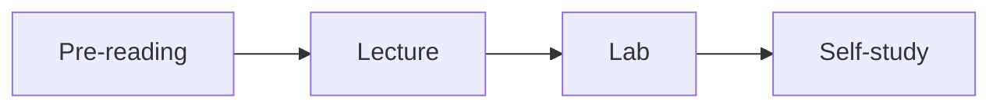

## Effort / Time Exchange
- The more effort take less time and the less effort takes more time.

## Omni-learner Principles
- [Neil Fleming](https://en.wikipedia.org/wiki/Neil_Fleming "Neil Fleming")'s **VARK** model
	- V = Visual
	- A = Auditory
	- R = Read / Write
	- K = Kinesthetic

## Methods to takes note and self-study

- "How do I summarize it?"
- "How do I organize it?"

## Iteration Effect
- Effective learning is a constant process of thinking of a **hypothesis** and then seeing if that **hypothesis** is right or wrong.
- **Hypothesis** = testing it to the max.