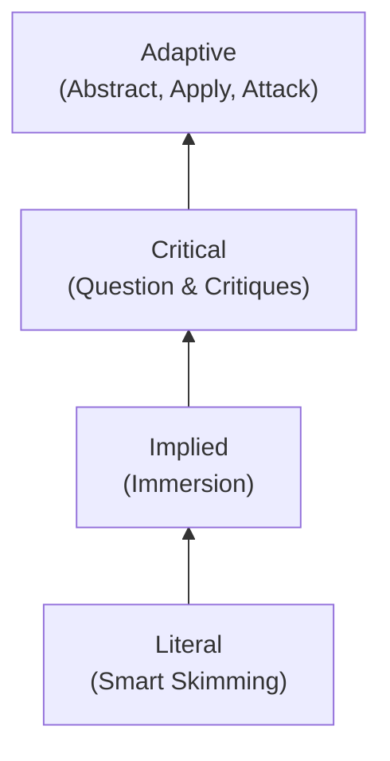

# 4 Levels of Comprehension

```mermaid
flowchart BT
a["Literal
(Smart Skimming)"]
b["Implied
(Immersion)"]
c["Critical
(Question & Critiques)"]
d["Adaptive
(Abstract, Apply, Attack)"]
a-->b-->c-->d
```
