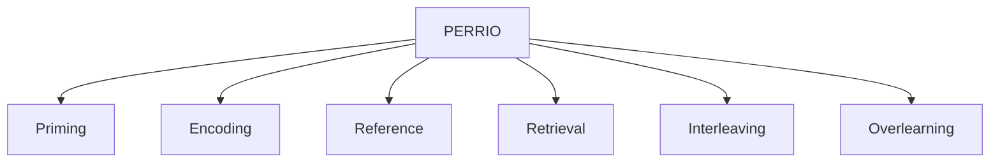
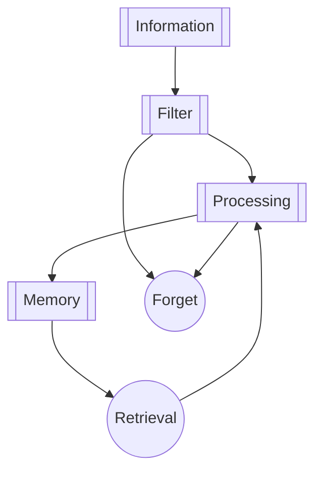
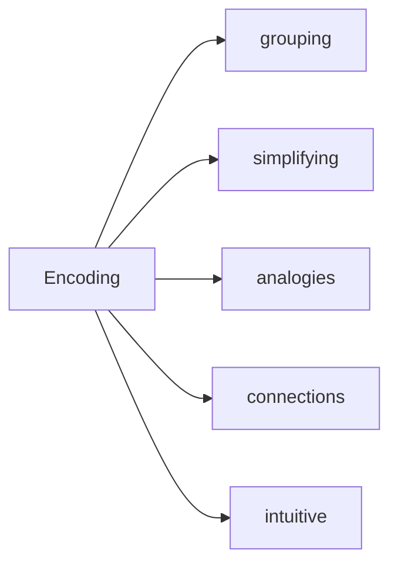
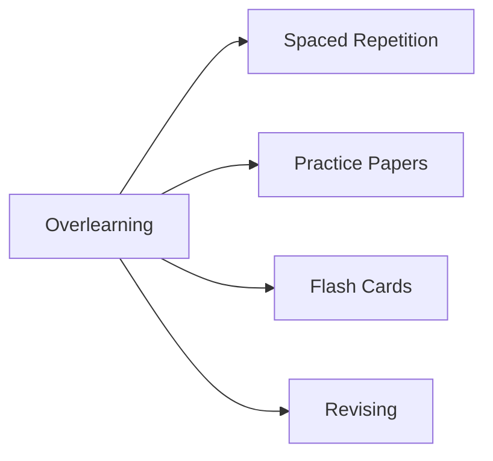

## PERRIO System Of Learning

- P - Priming
- E - Encoding
- R - Reference
- R - Retrieval
- I - Interleaving
- O - Overlearning

## Learning Theory

### Priming
- Any technique that use before main learning event.

### Encoding
- Techniques that will allow your brain to organize and process the information effectively.

### Reference
- Taking information and putting them somewhere also to revisit later on.
- Flash cards / Second Brain

### Retrieval
- Recovering of stored information from memory
- Active recall / Blurting
- The benefits of retrieval are
	1. testing the ability to use the knowledge and
	2. strengthening memory and deeper understanding.

### Interleaving
- Approaching a topic from various angles or perspectives

#### 4 Rules of Interleaving
1. Make yourself compare and contrast:
	- using different techniques to test your knowledge
	- testing your memory repeatedly
	- do not repeatedly use the same methods to test your memory
2. Look for variations.
3. Force compare and contrast frequently.
	- The benefits of interleaving seems to fade when the gap between interleaving sessions grow further apart.
	- As a general rule, compare and contrast every 10 to 15 minutes while it is fresh in your memory.
4. Build your knowledge overtime.

### Overlearning
- Going deeper into a topic to achieve a higher standard of **mastery**.

