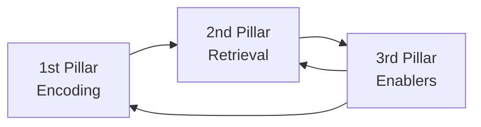
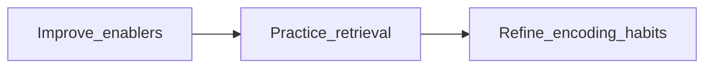

# 3 Pillars Of Learning

## 3rd Pillar - Enablers (The Foundation)
- _Self-management_: time management, avoiding procrastination, maintaining focus.
- _Growth skills_: experimentation + critical reflection (trying techniques, evaluating, improving).
- Without enablers, you can’t consistently study well — they are the rate limiters.

## 2nd Pillar - Retrieval (The Safety Net)
- Using information from memory → quizzes, practice questions, teaching, brain dumps, making your own tests, teaching others.
- Strengthens recall, finds gaps, builds fluency, and boosts exam confidence.
- Needs to be regular and aligned with how you’ll use the knowledge.

## 1st Pillar - Encoding (The Hallmark Of Top Learners)
- How you _process and interpret new information_ so it sticks deeply.
- Requires unlearning weak habits and developing better ones (mind mapping, active reading, structured thinking).
- Takes the longest to improve — often months to years — so it’s the last pillar to master.
- There are 3 ways to enhance encoding:
	1. Simplify everything
	2. Compare everything
	3. Connect everything
	4. Group/Organize everything

## Order of Development
1. Start with **enablers** → because without focus, consistency, and growth mindset, nothing else works.
2. Build **retrieval strategies** → provides a reliable system to catch gaps and reinforce memory.
3. Gradually improve **encoding skills** → ultimate long-term multiplier, but slow to master.

